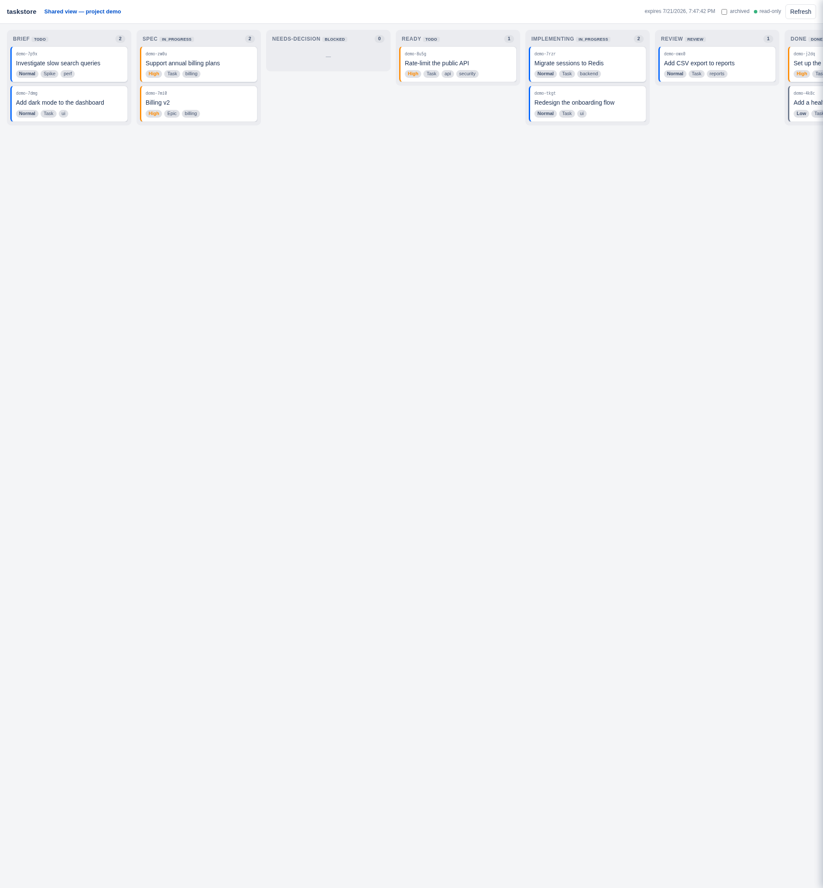

# Takomo

[](https://github.com/ChristianKohlberg/Takomo/actions/workflows/ci.yml)
[](LICENSE)

**One hosted, shared task tracker that every AI agent, orchestrator, and human on a project talks to over HTTP** — a single source of truth for work, instead of a todo list trapped in one checkout.

Repo-embedded trackers keep a nice trail inside one repository, but parallel work across multiple orchestrators, machines, and checkouts needs one authority everyone can reach. Takomo is that authority: hierarchical tickets, a real per-project state machine, atomic claim/lease so exactly one worker owns a ticket, and an append-only event log — with errors written to teach an LLM what to do next.

Community-hosted store: **https://your-takomo-host.onrender.com/v1**



> The image above is an illustrative preview, not a live screenshot. The real board is served (auth-gated) at `/board` on any running instance; open it after seeding a few tickets to see your own.

## Features

- **Hosted and shared.** One HTTP endpoint that every agent, orchestrator, and human reaches — no per-checkout state to reconcile.
- **Enforced state machine.** Per-project workflows with server-enforced transitions; illegal moves return a teaching `409` (current state, allowed transitions, and a remedy) written to be read by an LLM.
- **Atomic claim/lease.** A monotonic fencing token guarantees exactly one worker owns a ticket; expired leases return it to the ready queue automatically.
- **Hierarchy + dependencies.** `epic` → `task`/`bug`/`subtask` trees, `blocked_by` edges, labels, and free-form namespaced JSON metadata.
- **Append-only event log.** A durable `?since=<seq>` cursor plus an SSE stream — the audit trail and the wake feed in one.
- **Read-only web board** at `/board`, with scoped, expiring share links.
- **Anti-lock-in.** JSONL export/import with idempotent re-import, plus importers for beads and beans.
- **Single binary.** Rust + SQLite (WAL); one process, zero external services. Self-host anywhere or deploy in one click.

## Install

### Claude Code plugin (two lines)

This repository doubles as the plugin marketplace. From inside Claude Code:

```
/plugin marketplace add ChristianKohlberg/Takomo
/plugin install takomo
```

That installs the `takomo` skill (teaches the agent to use the store as its source of truth) and a remote MCP server pointing at the hosted endpoint. Supply your token via the `TAKOMO_TOKEN` environment variable before starting Claude Code — no token is stored in the plugin:

```sh
export TAKOMO_TOKEN="tk_<your read/write token>"
```

Details: [`plugins/takomo/README.md`](plugins/takomo/README.md).

### `takomo` CLI (one line)

`takomo` is a self-contained `bash` + `curl` + `python3` script. Install it standalone:

```sh
curl -fsSL https://raw.githubusercontent.com/ChristianKohlberg/Takomo/main/clients/cli/install.sh | sh
takomo help
```

From a checkout you can symlink the repo copy instead (so `git pull` keeps it current): `./clients/cli/install.sh`. The installer checks that `curl` and `python3` are present and puts `takomo` on your `PATH` (default `~/.local/bin`).

### Deploy your own store (one click)

[](https://render.com/deploy?repo=https://github.com/ChristianKohlberg/Takomo)

The [`render.yaml`](render.yaml) Blueprint provisions a web service with a persistent disk (SQLite durability) and a `/healthz` check. After the first deploy, mint an admin token over `render ssh` (see [Running the server](#running-the-server)). Self-hosting elsewhere? Use the portable [`Dockerfile`](Dockerfile).

## Onboard a repo — one command

From the root of any git repo, with an **admin token** for the store:

```sh
export TAKOMO_URL="https://your-takomo-host.onrender.com/v1"   # note the /v1
export TAKOMO_TOKEN="tk_<admin token>"                       # used only to provision

takomo init                    # or: takomo init myproject --workflow simple
```

`takomo init` creates the project (named after the repo) if it does not exist, applies the `simple` workflow, mints a `read,write` agent token scoped to just that project, and writes repo-local config:

- `.takomo/config` — `url` and `project` (safe to commit; share it with the team)
- `.takomo/token` — the agent token, mode `600`, added to `.gitignore` automatically

After that, `takomo` auto-loads `.takomo/` by walking up from your cwd, so no environment setup is needed inside the repo. Precedence is explicit flag > environment > `.takomo`.

## Work the queue

```sh
takomo whoami                          # confirm identity: actor, scopes, projects
takomo new "Wire up the frobnicator"   # create a ticket (warns about likely duplicates)
takomo ready                           # what's claimable right now
takomo roadmap                         # epic progress: a bar + child counts per epic
ID=$(takomo next | awk '{print $2}')   # atomically claim the next ready ticket
takomo start "$ID"                     # -> in_progress (the lease fence is remembered for you)
takomo comment "$ID" "opened PR, waiting on CI"
takomo link "$ID" --pr https://github.com/org/repo/pull/42
takomo done "$ID"                      # -> done (claim auto-releases)
```

Every rejection is a teaching response: an illegal move returns the allowed transitions and a remedy, and `takomo` prints them for you. Never retry a rejected call unchanged. Full CLI reference: [`clients/cli/README.md`](clients/cli/README.md).

### The `simple` workflow

The default plain-tracker state machine (a drop-in for beads/beans): `draft → todo → in_progress → done`, with `blocked` and `cancelled` as escape hatches. `todo` is claimable (it feeds the ready queue). Claiming is the only gate to move a ticket — there are no human-approval gates — so one person or a fleet of agents can just work the queue. Full definition: [`workflows/simple.yaml`](workflows/simple.yaml). Projects can run richer workflows (approval gates, autoland) — see [`spec/workflow-format.md`](spec/workflow-format.md).

## Auth and tokens

Bearer tokens (`tk_...`), scoped, hashed at rest (SHA-256), shown in plaintext exactly once at mint time. `actor` is the identity everywhere (created_by, comment author, claim holder, event actor) — one token per agent/human, never shared.

Scopes: `read` (all GETs), `write` (create/claim/transition/…), `human` (approval gates), `autoland` (auto-merge gates), `admin` (projects incl. delete, workflows, tokens).

Tokens are managed two ways, sharing the same logic:

- **CLI against the DB** on the server: `takomo token create|list|revoke` — the root of trust for the first admin token.
- **HTTP, admin-scoped** (what makes `takomo init` one-command onboarding): `POST /v1/tokens` (mint, returns the plaintext once), `GET /v1/tokens` (list metadata — never the plaintext or hash), `DELETE /v1/tokens/{id}` (revoke), `GET /v1/whoami` (echo your own actor/scopes/projects).

Full rationale: [`spec/auth.md`](spec/auth.md).

## Security notes

- **Tokens are the whole perimeter.** They are bearer credentials — hashed at rest and shown once. Keep them out of git (`takomo init` gitignores `.takomo/token`), rotate by revoke-and-remint, and use one narrowly-scoped token per actor so a leak is contained and revocable in isolation.
- **Share links are unauthenticated by design.** A share link grants read access to one project's board without a token, and expires; treat any link you create as public for its lifetime and set a short expiry.
- **TLS is the platform's job.** The server terminates plain HTTP and expects to sit behind TLS (platform, reverse proxy, or Tailscale). It refuses non-loopback binds unless `TAKOMO_ALLOW_PUBLIC_BIND=1`.
- **WAF / User-Agent.** Some deployments sit behind a WAF that blocks the default `python-urllib` User-Agent. `takomo` uses curl (whose UA passes); if you write your own client, set a custom `User-Agent` header.

## Running the server

One binary: HTTP server plus `token` / `project` admin subcommands.

```sh
cargo build --release
alias takomo=./target/release/takomo

takomo --db takomo.db token create --actor human:me --scopes read,write,human,admin --projects '*'
takomo --db takomo.db serve --bind 127.0.0.1:8080
```

Deployment topology is in [`render.yaml`](render.yaml) / [`Dockerfile`](Dockerfile).

### Backups (Litestream)

Continuous, off-box backup to S3-compatible storage is **prepared but off by default** — no credentials live in the repo. The bundled Docker image ships with [Litestream](https://litestream.io/) and turns it on automatically once you provide a bucket. One-time operator activation:

1. Create an S3-compatible bucket (AWS S3, Cloudflare R2, MinIO, Backblaze B2, …).
2. Provide these as platform secrets / environment variables (never commit them): `LITESTREAM_BUCKET`, `LITESTREAM_ACCESS_KEY_ID`, `LITESTREAM_SECRET_ACCESS_KEY`, and optionally `LITESTREAM_ENDPOINT` (for non-AWS S3) and `LITESTREAM_REGION`.
3. Run the server under Litestream. With the Docker image, setting `LITESTREAM_BUCKET` is enough — [`deploy/docker-entrypoint.sh`](deploy/docker-entrypoint.sh) wraps `serve` in `litestream replicate` and restores from the replica on a fresh disk. Elsewhere, wrap the start command yourself:

   ```sh
   litestream replicate -config litestream.yml \
     -exec "takomo --db /var/data/takomo.db serve --bind 0.0.0.0:$PORT"
   ```

The default (non-Litestream) start path keeps working unchanged when those variables are unset. Config: [`litestream.yml`](litestream.yml).

## Design docs

Takomo started as a research question — adopt an existing tracker or build one? — resolved in favor of a small purpose-built store. The evaluation of beans, beads, agent-native and hosted trackers, the adopt-vs-build synthesis, the build architecture, the broader factory vision, and an honest DX-gap list are under [`docs/design/`](docs/design/) (start with [`00-synthesis.md`](docs/design/00-synthesis.md) and [`06-factory-vision.md`](docs/design/06-factory-vision.md)).

The full v1 HTTP API — tickets, workflows, claims/leases, the token endpoints, and the event log — is specified in [`spec/openapi.yaml`](spec/openapi.yaml). `/healthz` is the only open endpoint; every other call carries `Authorization: Bearer tk_...`.

## Onboarding an agent harness

- CLI reference: [`clients/cli/README.md`](clients/cli/README.md).
- Runtime skill (agents work the store as their source of truth): [`clients/claude-skill/takomo/SKILL.md`](clients/claude-skill/takomo/SKILL.md).
- One-shot repo onboarding skill (guides an agent through `takomo init` + wiring): [`clients/claude-skill/takomo-onboard/SKILL.md`](clients/claude-skill/takomo-onboard/SKILL.md).
- Claude Code plugin (skill + remote MCP server): [`plugins/takomo/README.md`](plugins/takomo/README.md).

## Development

CI runs on every push and PR ([`.github/workflows/ci.yml`](.github/workflows/ci.yml)): a release build, Clippy (`-D warnings`), `rustfmt --check`, the test suite, ShellCheck on the `takomo` CLI, and a typecheck of the MCP server.

```sh
cargo build --release                            # build the binary
cargo test --release                             # integration suite (spawns real servers)
cargo clippy --all-targets -- -D warnings        # lint, warnings-as-errors
cargo fmt                                         # format (rustfmt.toml); CI runs --check
shellcheck clients/cli/takomo clients/cli/install.sh # shell CLI lint
(cd clients/mcp && npm ci && npm run build)      # MCP typecheck
```

### A running instance with backlot

[backlot](https://github.com/ChristianKohlberg/backlot) brokers a warm, running takomo for inspection or manual testing. With `backlot` installed, from the repo root: `backlot up` (build, provision a fresh store, serve, print the URL + port), `backlot ctx` (the URL/ports an agent needs), `backlot release` (return the environment to the pool). The manifest is [`stack.yaml`](stack.yaml).

### Quality gates (handrail)

[handrail](https://github.com/ChristianKohlberg/handrail) gates in [`.handrail/`](.handrail/) surface project norms in-session — they *guide*, they do not enforce (CI is the wall): new/changed HTTP routes should ship with an integration test, `spec/openapi.yaml` should track route changes, and `cargo fmt` / `clippy` stay clean. With `handrail` installed: `handrail list`, `handrail run --changed`.

## License

Apache-2.0. See [`LICENSE`](LICENSE); attribution in [`NOTICE`](NOTICE).
